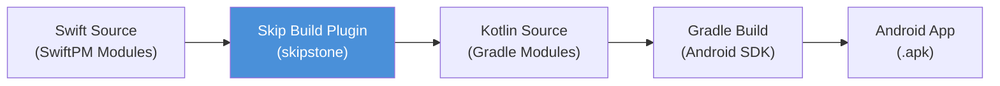
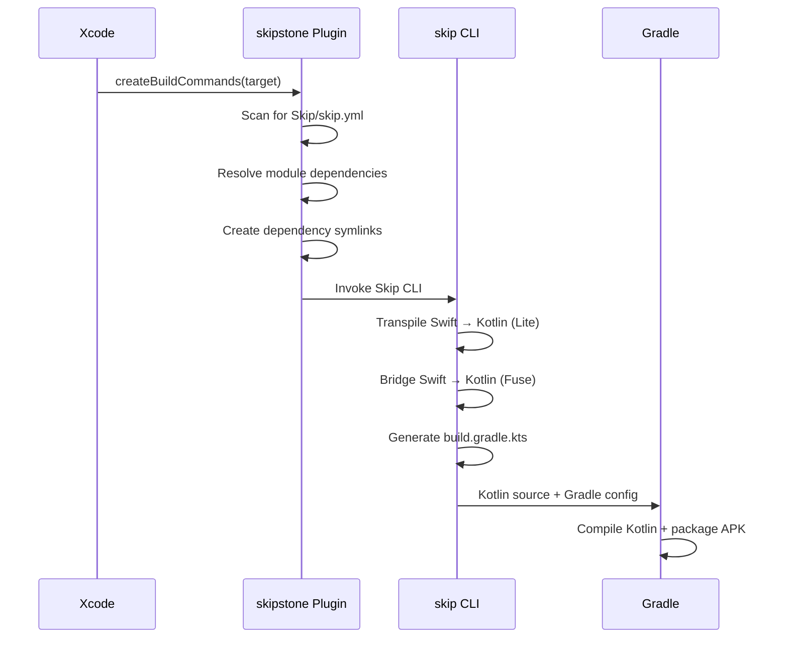
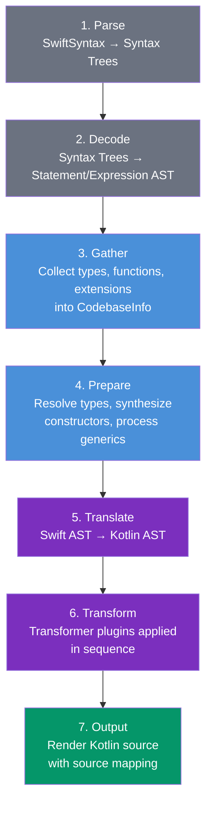
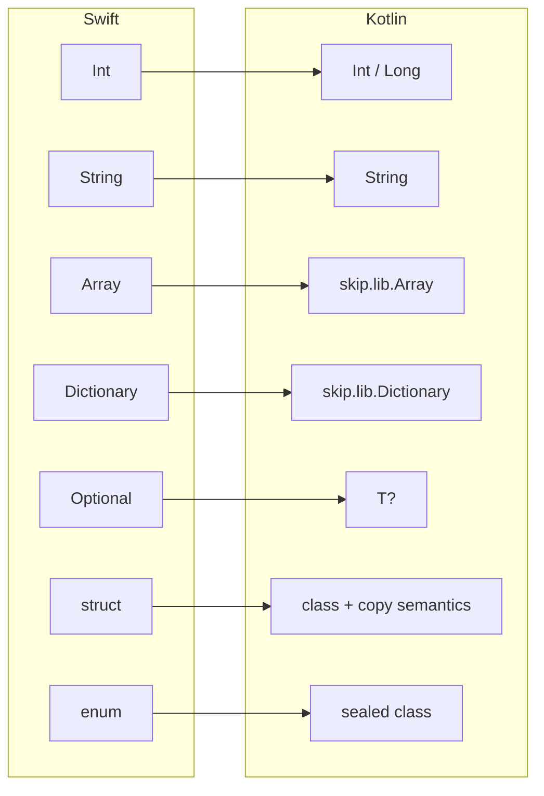
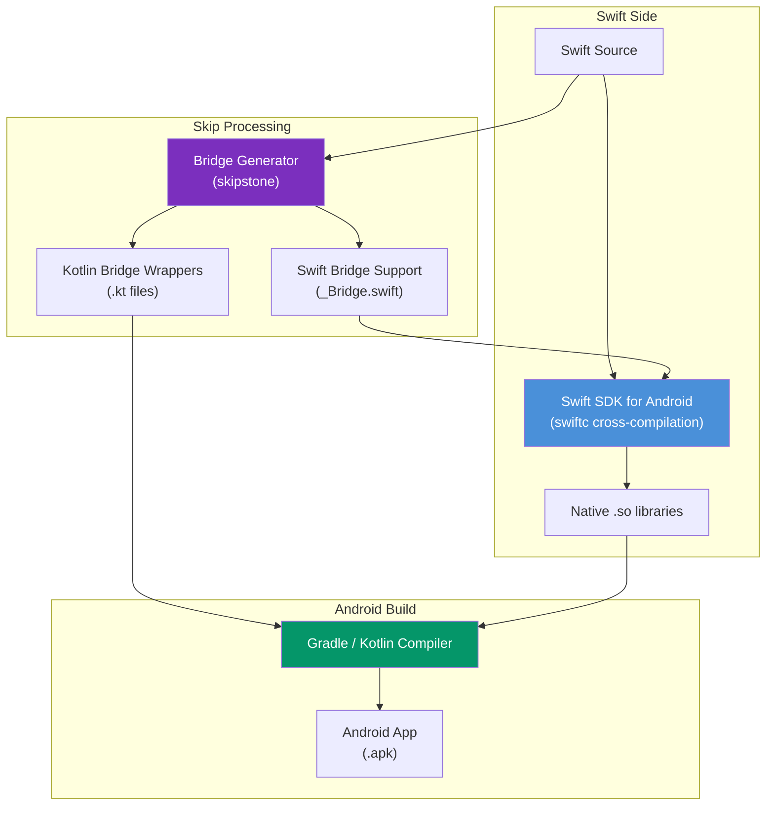
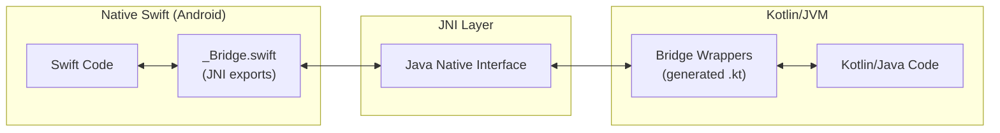
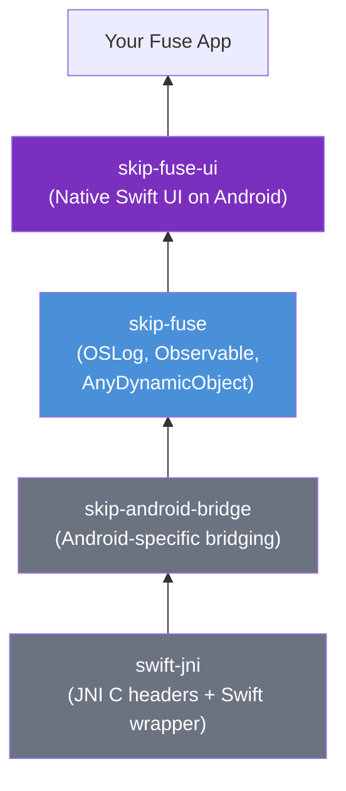
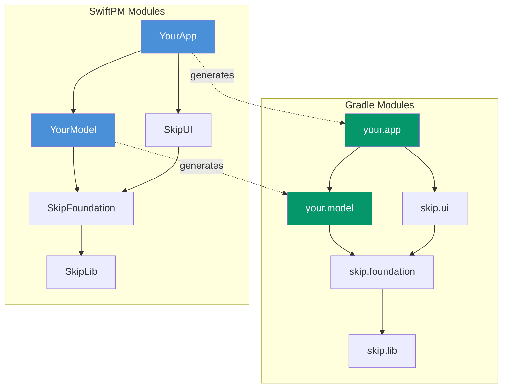
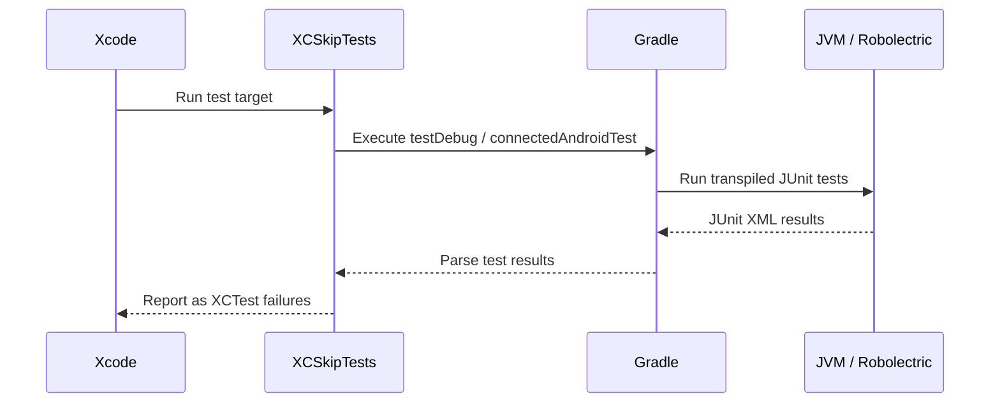
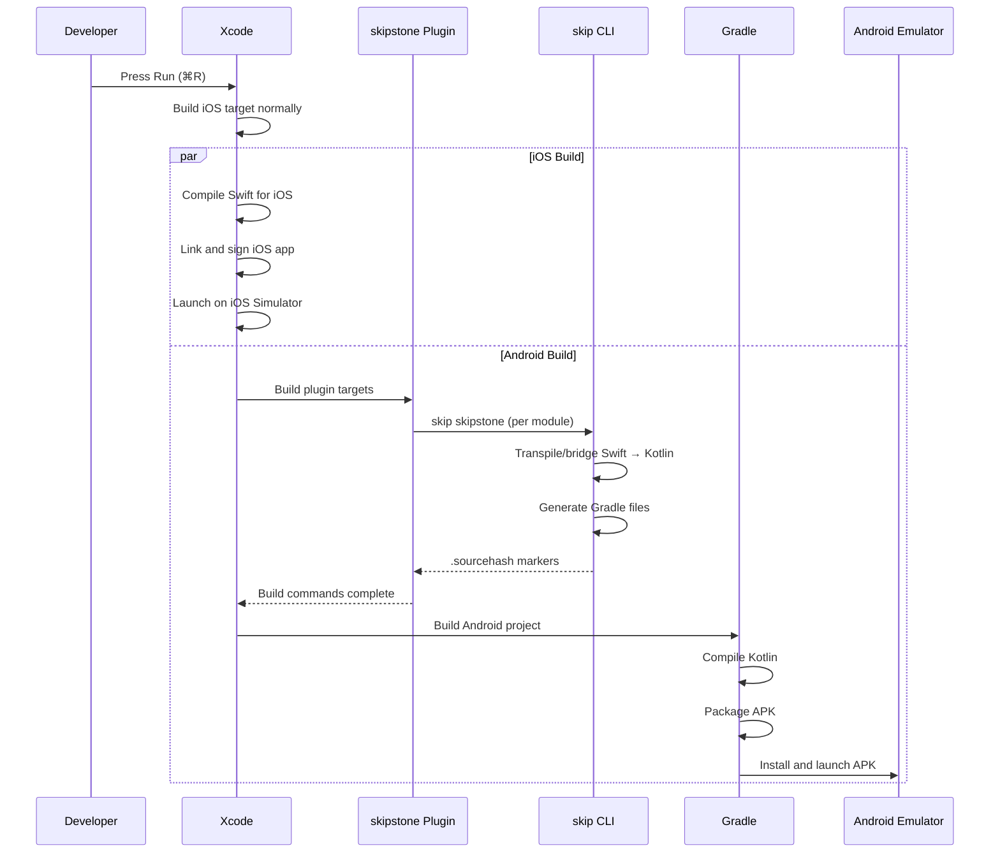

import { FileTree } from '@astrojs/starlight/components';

This document describes the internal architecture of Skip: how Swift source becomes a running Android app. It covers the build plugin integration, the `skipstone` processing pipeline, Gradle project generation, resource processing, and the app launch sequence. For a higher-level overview of Skip's two modes, see [Lite and Fuse Modes](/docs/modes/).

## Overview

Skip operates as a SwiftPM build plugin that hooks into Xcode's build system. When you build your project, Skip processes each Swift module in your dependency tree, producing a parallel tree of Gradle modules containing Kotlin source code. Gradle then compiles and packages this Kotlin into an Android app that launches alongside iOS in the simulator or on a device.



The process differs depending on the [mode](/docs/modes/) of each module:

- **Skip Lite** modules have their Swift source *transpiled* to Kotlin by the Skip transpiler.
- **Skip Fuse** modules have their Swift source *compiled natively* for Android using the [Swift SDK for Android](https://www.swift.org/documentation/articles/swift-sdk-for-android-getting-started.html), with auto-generated JNI bridging to Kotlin.

Both modes produce Gradle modules that participate in the same Android build.

## Build Plugin Integration

### Source Repositories

Skip's build infrastructure spans two repositories:

| Repository | Provides |
|---|---|
| [skipstone](https://github.com/skiptools/skipstone) | The `skip` binary command-line interface |
| [skip](https://github.com/skiptools/skip) | The `skipstone` SwiftPM build plugin and test harness |

The `skip` repository vends a SwiftPM build tool plugin named **skipstone**. In release builds, this plugin downloads a pre-built `skip` binary from the `skipstone` repository. For local development (when `SKIPLOCAL` is set or the working directory ends with "skipstone"), it uses a locally built version instead.

### How the Plugin Hooks into Xcode

The `skipstone` plugin implements SwiftPM's [`BuildToolPlugin`](https://docs.swift.org/swiftpm/documentation/packagemanagerdocs/writingbuildtoolplugin/#Build-commands) protocol. During a build, Xcode calls `createBuildCommands(context:target:)` for each target in the project. The plugin:

1. **Scans** the target for a `Skip/skip.yml` configuration file. Targets without this file are excluded from processing.
2. **Resolves dependencies** by walking the target's dependency graph and collecting peer modules that also have `skip.yml` files.
3. **Creates symbolic links** to dependent modules' plugin output directories, so each module can reference its dependencies during Gradle compilation.
4. **Emits a build command** that invokes the `skip` CLI with the appropriate arguments.



### Plugin Output Structure

The plugin writes its output to the standard SwiftPM plugin output directory. The exact path varies by environment:

| Environment | Output Path |
|---|---|
| Xcode | `DerivedData/.../SourcePackages/plugins/<package>.output/<target>/skipstone/` |
| SwiftPM 5 CLI | `.build/plugins/outputs/<package>/<target>/skipstone/` |
| SwiftPM 6 CLI | `.build/plugins/outputs/<package>/<target>/destination/skipstone/` |

Within each module's output directory, Skip generates a complete Gradle module:

<FileTree>
- ModuleName/
  - build.gradle.kts Generated from Package.swift + skip.yml
  - src/
    - main/
      - kotlin/
        - module/
          - name/ Kotlin package (e.g., skip.ui)
            - TranspiledFile.kt One .kt per .swift source file
      - assets/ Processed resources (Android AssetManager)
      - res/ Android resources (strings, values)
    - test/
      - kotlin/ Transpiled XCTest cases (JUnit)
  - .sourcehash Incremental build marker
</FileTree>

### Incremental Builds

Skip tracks source file modifications using `.sourcehash` marker files. Each module's build command declares its `.sourcehash` file as both an input (for dependent modules) and an output. This creates a dependency chain that ensures modules are transpiled in the correct order and only when their sources have changed.

### The skip.yml Configuration

Each module's `Skip/skip.yml` file controls how Skip processes that module. An example of this file is:

```yaml
skip:
  mode: 'native'            # 'native' for Fuse, absent/transpiled for Lite
  bridging: true            # Enable auto-bridging of public API (Fuse)
  resources:                # Custom resource paths
    - path: CustomResources
      mode: copy            # 'process' (default) or 'copy'
build:
  contents:
    - block: 'dependencies' # Android/Gradle dependencies
      contents:
      - implementation("androidx.compose.material3:material3:1.2.0")
```

The `skip` block controls the behavior and structure of the Skip processing, and the `settings` and `build` blocks enable customization of the module's output `settings.gradle.kts` and `build.gradle.kts` files. This is most commonly used to adding [Maven-style dependencies](https://docs.gradle.org/current/userguide/dependency_management_for_java_projects.html) to the Gradle project in order to integrate with external dependencies.

For the full reference on Gradle configuration, see [Gradle Project Reference](/docs/gradle/).

## Skip processing modes

All Skip projects contain some transpiled Skip Lite modules. For example, [SkipUI](/docs/modules/skip-ui/) is always transpiled into Kotlin, regardless of whether the top-level application is a compiled Skip Fuse or a transpiled Skip Lite app. In the case of Skip Fuse, the additional native [SkipFuseUI](/docs/modules/skip-fuse-ui/) module handles the Swift-side bridging to the transpiled Skip Lite Jetpack Compose code created by the SkipUI module.

More generally, Skip Fuse modules can depend on Skip Lite modules and interface with them by bridging code. This is how natively compiled apps can integrate with the various platform frameworks (such as [SkipAV](/docs/modules/skip-av/), [SkipNFC](/docs/modules/skip-nfc/), and [SkipBluetooth](/docs/modules/skip-bluetooth/)) and third-party integration modules (such as [SkipFirebase](/docs/modules/skip-firebase/), [SkipSupabase](/docs/modules/skip-supabase/), and [SkipAuth0](/docs/modules/skip-auth0/)) that Skip provides.

A module's mode is determined by `skip.yml`:

```yaml
skip:
  mode: 'transpiled' | 'native'  # transpiled Lite or compiled Fuse mode
  bridging: true                 # Auto-bridge all public API
```

When `mode` is set to `native`, Skip also checks for the presence of [SkipFuse](/docs/modules/skip-fuse/) in the dependency tree. An `automatic` mode (the default) selects native mode when SkipFuse is present and the module is the primary app module.

### Skip Lite: Transpilation Pipeline {#lite-pipeline}

In [Skip Lite](/docs/modes/#lite) mode, the transpiler converts Swift source code into equivalent Kotlin source code. This is a multi-phase pipeline implemented primarily in the `SkipSyntax` module of the `skipstone` repository.



#### Phase 1–2: Parse and Decode

Skip uses the standard [SwiftSyntax](https://github.com/swiftlang/swift-syntax) library to parse Swift source files into syntax trees. These are then decoded into Skip's internal AST representation — a tree of `Statement` and `Expression` nodes that capture the semantic structure of the code.

Multiple files are parsed concurrently using Swift's structured concurrency (`withThrowingTaskGroup`).

#### Phase 3–4: Gather and Prepare

The **gather** phase walks all parsed files to build a `CodebaseInfo` object — a codebase-wide symbol table that tracks:

- All type declarations (classes, structs, enums, protocols, actors)
- Extension declarations and their associated types
- Top-level functions and variables
- Type aliases
- Exported symbols from dependent modules

Each transformer also has a `gather()` method that runs during this phase to collect transformer-specific information.

The **prepare** phase (`prepareForUse()`) resolves type references, synthesizes implicit constructors, and processes generics. This gives the translation phase a complete picture of the codebase's type system.

#### Phase 5: Translate

The `KotlinTranslator` converts each Swift AST node into its Kotlin equivalent, producing a `KotlinSyntaxTree`. This includes:

- **Module name mapping**: Swift module names are converted to Kotlin package names following the convention `CamelCase` → `lower.dot.separated` (e.g., `SkipFoundation` → `skip.foundation`). Custom mappings can be specified in `skip.yml`.
- **Import resolution**: Swift imports are mapped to their Kotlin equivalents, referencing the framework modules like [SkipLib](/docs/modules/skip-lib/), [SkipFoundation](/docs/modules/skip-foundation/), and [SkipUI](/docs/modules/skip-ui/).
- **Statement and expression translation**: Each Swift construct is mapped to its Kotlin counterpart.

#### Phase 6: Transform {#transformers}

After initial translation, a sequence of approximately 20 `KotlinTransformer` implementations refine the Kotlin AST. **Order matters** — each transformer may depend on changes made by earlier ones. The transformers handle the fundamental differences between Swift and Kotlin semantics:

| Transformer | Purpose |
|---|---|
| **EscapeKeywords** | Escapes identifiers that collide with Kotlin hard keywords |
| **OptionSet** | Implements Swift's `OptionSet` protocol contract in Kotlin |
| **Struct** | Adds copy semantics, mutation tracking (`willmutate`/`didmutate`), and memberwise initializers for structs |
| **CommonProtocols** | Removes protocol conformances not needed in Kotlin |
| **Codable** | Generates `encode`/`decode` implementations for `Codable` types |
| **RawRepresentable** | Adds factory functions for `RawRepresentable` types |
| **Enum** | Converts enums to Kotlin sealed classes, synthesizes `CaseIterable` |
| **ConstructorAndSideEffectSuppression** | Manages constructor synthesis and side-effect suppression |
| **ErrorToThrowable** | Maps Swift's `Error` protocol to Kotlin's `Throwable` |
| **Observation** | Transforms `@Observable` properties for Compose state integration |
| **IfWhen** | Converts `if`/`else` chains to Kotlin `when` expressions |
| **Defer** | Implements Swift's `defer` statements |
| **DisambiguateFunctions** | Resolves overloaded function ambiguities |
| **TupleLabel** | Handles tuple label semantics |
| **Concurrency** | Transforms `async`/`await`, `Task`, and structured concurrency |
| **SwiftUI** | Translates SwiftUI views and modifiers to [Jetpack Compose](/docs/modules/skip-ui/) |
| **Imports** | Resolves and generates Kotlin import statements |
| **UnitTest** | Converts XCTest assertions to [JUnit equivalents](/docs/modules/skip-unit/) |
| **Bundle** | Processes resource bundle references |
| **FoundationBridge** | Bridges [Foundation](/docs/modules/skip-foundation/) framework calls |
| **Bridge** | Generates bidirectional Swift-Kotlin interop code (when [bridging](/docs/bridging/) is enabled) |

The **SwiftUI transformer** converts SwiftUI view declarations, modifiers, and state management into Jetpack Compose equivalents. This is what enables [SkipUI](/docs/modules/skip-ui/) to render native Android UI from SwiftUI code.

The **Struct transformer** ensures that Swift's value-type semantics (copy-on-write, mutation tracking) are faithfully reproduced in Kotlin's reference-type world.

#### Phase 7: Output

The `OutputGenerator` renders the Kotlin AST into source text, producing one `.kt` file per `.swift` input file. During rendering, it builds an `OutputMap` that records byte-offset mappings between the generated Kotlin and the original Swift source.

These source maps are used by the [test harness](/docs/testing/) to map Kotlin stack traces back to Swift file and line locations, making test failures and runtime errors navigable in Xcode.

#### Type Mapping

The transpiler maps Swift types to their Kotlin/Skip equivalents:



Note that Swift's `Int` (64-bit) maps to Kotlin's `Int` (32-bit) in Skip Lite. This is a known source of silent overflow bugs — see [Swift Support](/docs/swiftsupport/) for details on numeric handling.

Collection types like `Array` and `Dictionary` use the [SkipLib](/docs/modules/skip-lib/) implementations (`skip.lib.Array`, `skip.lib.Dictionary`) rather than Kotlin's standard library collections, because these implementations preserve Swift's value-type copy semantics.

### Skip Fuse: Native Compilation Pipeline {#fuse-pipeline}

In the [Skip Fuse](/docs/modes/#fuse) `native` mode, a module's Swift source is compiled natively for Android using the official Swift SDK for Android (Swift 6.3+). The transpiler is still involved, but its role changes from full transpilation to **bridge generation**.



#### How Fuse Differs from Lite

In Fuse mode, the `skip skipstone` command treats the module's Swift files as **bridge files** rather than transpile files. Instead of converting Swift to Kotlin line-by-line, it:

1. **Analyzes** the Swift API surface (public types, methods, properties).
2. **Generates Kotlin bridge wrappers** that call into native Swift via JNI.
3. **Generates Swift bridge support files** (`_Bridge.swift`) that expose Swift symbols to the JNI layer.
4. **Generates the Gradle module** with both the Kotlin wrappers and a reference to the native `.so` library.


#### Bridging Architecture

The bridge system is bidirectional, enabling both Swift-to-Kotlin and Kotlin-to-Swift calls:



Two specialized visitors generate the bridge code:

- **`KotlinBridgeToSwiftVisitor`** — generates Kotlin wrapper classes that delegate method calls to native Swift via JNI.
- **`KotlinBridgeToKotlinVisitor`** — generates pure Kotlin code for types that need to be accessible from the Kotlin side.

Bridge generation can be configured at different granularities — see [Bridging](/docs/bridging/) for details on per-item (`@bridge`), per-type (`@bridgeMembers`), and module-wide (`bridging: true`) configuration.

#### Fuse Dependencies

Skip Fuse apps rely on a chain of infrastructure modules:



The [SkipFuse](/docs/modules/skip-fuse/) module provides runtime support including `@Observable` state synchronization with Jetpack Compose. Any Swift file defining an `@Observable` type in a Fuse module **must** `import SkipFuse` for Android UI updates to work correctly.

## Gradle Project Generation {#gradle}

Skip automatically generates a complete Gradle project structure that mirrors your SwiftPM dependency tree. The `GradleProject` system in the `SkipBuild` module handles this conversion.

### From Package.swift to build.gradle.kts

For each Swift module with a `skip.yml` file, Skip generates a `build.gradle.kts` file that includes:

- **Plugins**: Android library or application plugin, Kotlin plugin, Compose compiler plugin
- **Dependencies**: Both inter-module dependencies (via project references) and external Gradle dependencies (from `skip.yml`)
- **Source sets**: Pointing to the generated Kotlin source directories
- **Android configuration**: Min/target SDK versions, Compose settings, ProGuard rules

The generated Gradle blocks use a tree-structured `GradleBlock` representation that supports merging — blocks with the same name from `skip.yml` configuration are merged with the generated defaults, allowing fine-grained customization.

### Project-Level Files

In addition to per-module `build.gradle.kts` files, Skip generates:

| File | Purpose |
|---|---|
| `settings.gradle.kts` | Module includes, plugin management, list of bridged modules |
| `gradle.properties` | JVM args, AndroidX flags, custom properties from `skip.yml` |
| `gradle/wrapper/gradle-wrapper.properties` | Gradle version pinning |

For app projects, the top-level `Android/` directory contains a hand-editable Gradle configuration that includes the generated modules. See [Gradle Project Reference](/docs/gradle/) for the complete structure.

### Dependency Mirroring

Skip creates a Gradle dependency tree that mirrors the SwiftPM dependency tree:



Each framework module — [SkipLib](/docs/modules/skip-lib/), [SkipFoundation](/docs/modules/skip-foundation/), [SkipModel](/docs/modules/skip-model/), [SkipUI](/docs/modules/skip-ui/), and [SkipUnit](/docs/modules/skip-unit/) — is processed by the plugin and linked into the Gradle tree via symbolic links to their plugin output directories.

## Resource Processing {#resources}

Skip processes resources from your Swift module and makes them available to the Android build through Gradle's asset and resource systems.

### Resource Discovery

Resources are located by:

1. **Default**: The `Resources/` directory within the module source folder.
2. **Explicit configuration**: Paths specified in `skip.yml` under `skip.resources`.

### Processing Modes

| Mode | Behavior | Use Case |
|---|---|---|
| **Process** (default) | Flattens directory hierarchy; converts `.xcstrings` to Android `strings.xml` | Standard app resources, localizable strings |
| **Copy** | Preserves directory hierarchy as-is | Pre-structured assets, custom file layouts |

Processed resources are output to `src/main/assets/<package>/<name>/` for access via Android's `AssetManager`, or to `src/main/res/` for Android resource types like localized strings.

### Localizable Strings

Xcode's `.xcstrings` files (string catalogs) are automatically converted to Android's `values/strings.xml` format during the process phase. This allows a single set of localization files to serve both platforms.

### Resource Linking

Rather than copying resource files, Skip creates symbolic links from the Gradle output directory back to the original source files. This means edits to resources are immediately reflected in the next Android build without requiring re-transpilation. Read-only resources (from dependencies) are copied instead.

## Test Execution {#testing}

Skip integrates with Xcode's test runner to execute transpiled or compiled tests on the JVM or Android. The test infrastructure is provided by the `SkipTest` and `SkipDrive` modules in the [skip](https://github.com/skiptools/skip) repository.

### Skip Lite Test Flow



Every `XCTestCase` subclass in a Lite test target is automatically transpiled to a Kotlin/JUnit test class by the [SkipUnit](/docs/modules/skip-unit/) transformer. The `XCSkipTests` harness (auto-generated if not present) coordinates execution:

1. **Robolectric** (default, no device needed): Runs transpiled tests on the local JVM using Robolectric for Android API simulation. Invoked with the Gradle `testDebug` action.
2. **Instrumented** (with `ANDROID_SERIAL` set): Deploys and runs tests on a real Android device or emulator via `connectedDebugAndroidTest`.

### Skip Fuse Test Flow

Fuse tests are cross-compiled as native Swift for Android and executed via `adb`:

- **CLI mode** (`skip android test`): Pushes a bare executable to the device. Supports resource bundles but not Android framework APIs.
- **APK mode** (`skip android test --apk`): Packages tests in an APK with full JNI and Android framework access.

See [Testing](/docs/testing/) for the complete testing guide.

### Error Mapping

When a Kotlin test fails or a runtime error occurs, the `GradleDriver` in `SkipDrive` parses the Gradle output line-by-line, extracting Kotlin file paths and line numbers. It then uses the source maps generated during [output](#lite-pipeline) to translate these back to the original Swift source locations, so failures appear in Xcode at the correct Swift file and line.

## App Build and Launch {#launch}

When you press Run in Xcode for a Skip project, the following sequence occurs:



### Build Actions

The `.xcconfig` file for the iOS app controls the Android build behavior via the `SKIP_ACTION` setting:

| Value | Behavior |
|---|---|
| `launch` (default) | Build and launch on Android emulator/device |
| `build` | Build the APK but do not launch |
| `none` | Skip the Android build entirely (iOS-only iteration) |

For more details on specific topics:

- [Lite and Fuse Modes](/docs/modes/) — choosing between transpiled and native compilation
- [Gradle Project Reference](/docs/gradle/) — detailed Gradle structure and configuration
- [Bridging](/docs/bridging/) — Swift-Kotlin interop in Fuse mode
- [Testing](/docs/testing/) — running tests on Android
- [Deployment](/docs/deployment/) — exporting and distributing your app
- [Platform Customization](/docs/platformcustomization/) — using `#if SKIP` and `#if os(Android)` for platform-specific code
- [Swift Support](/docs/swiftsupport/) — supported Swift language features in Skip Lite
